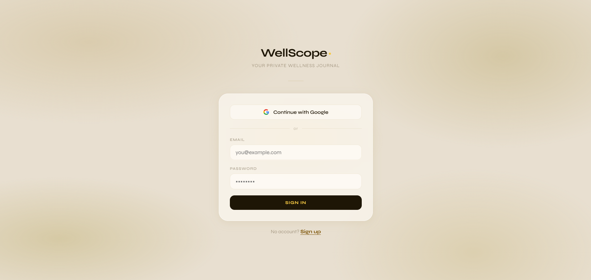
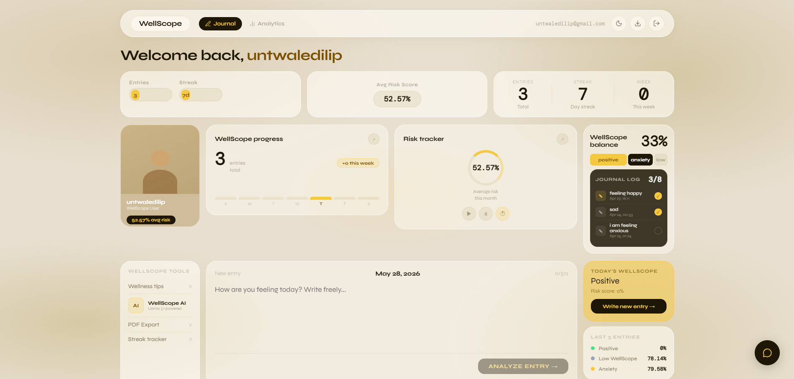
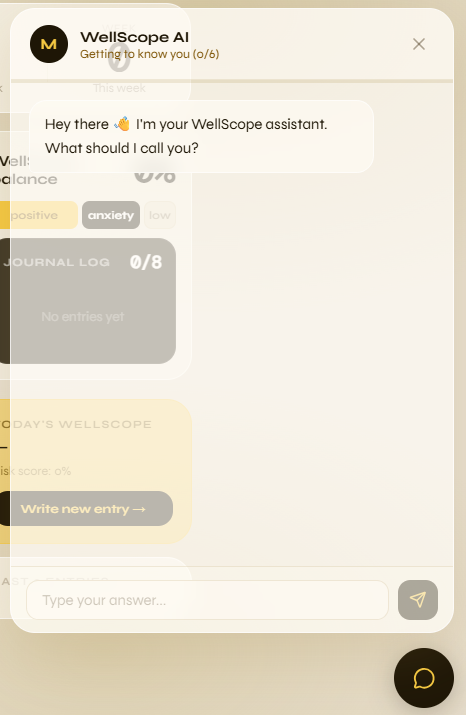
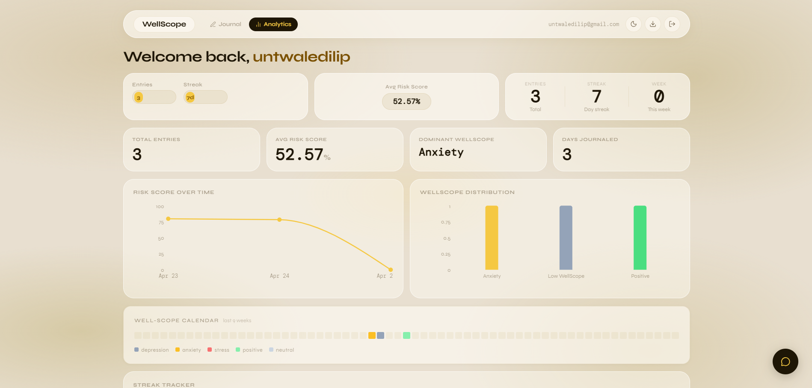
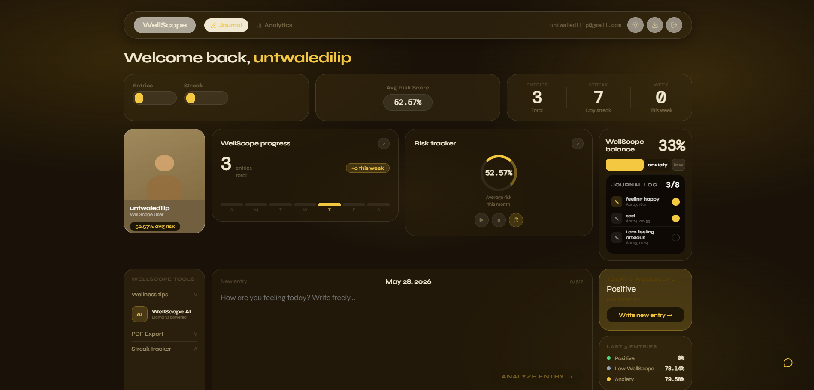

<div align="center">


# WellScope 🌿
### AI-Powered Mental Health Monitoring Platform

*A full-stack web application that analyzes your journal entries using RoBERTa emotion classification to detect and track mental health patterns — with a personalized AI wellness companion that remembers you.*

[](https://wellscope.vercel.app)
[](https://vercel.com)
[](https://render.com)
[](LICENSE)

</div>

---

## 📖 About The Project

WellScope started as a casual vibe-coding session for a college mini project assessment. We came across a research paper on detecting mental health patterns from social media text using NLP — and by midnight we were building.

What started as *"let's just submit something decent"* turned into something we genuinely cared about.

Many people express their true emotional state more honestly in text — journals, messages, social media — than in clinical interviews. WellScope gives users a **private, non-judgmental space** to write freely, while AI quietly helps them understand their own mental patterns over time.

> ⚠️ **Disclaimer:** WellScope is not a medical tool. It is not intended to diagnose, treat, or replace professional mental health care. If you are in crisis, please contact a mental health professional or call **iCall: 9152987821**.

---

## 🛠️ Technology Stack

### Frontend
| Technology | Purpose |
|---|---|
| React.js 18 | Component-based UI framework |
| Vite | Build tool and dev server |
| CSS Modules | Scoped component styling |
| TanStack React Query | Server state management & caching |
| Recharts | Interactive mood charts |
| date-fns | Date formatting utilities |
| jsPDF | Client-side PDF export |
| Lucide React | Icon library |

### Backend
| Technology | Purpose |
|---|---|
| Node.js 18+ | JavaScript runtime |
| Express.js | REST API framework |
| Supabase JS Client | Database & auth client |
| Groq SDK | Llama 3.1 LLM inference |
| Axios | HTTP client for AI service calls |
| Helmet | Security headers |
| express-rate-limit | API rate limiting |

### AI Microservice
| Technology | Purpose |
|---|---|
| Python 3.11 | Runtime language |
| FastAPI | Async web framework |
| Uvicorn | ASGI server |
| httpx | Async HTTP client |
| Hugging Face Inference API | RoBERTa emotion classification |

### Database & Auth
| Technology | Purpose |
|---|---|
| Supabase (PostgreSQL) | Primary database |
| Supabase Auth | JWT authentication |
| Google OAuth 2.0 | Social login |
| Row Level Security | Data isolation per user |

### Deployment
| Service | Purpose |
|---|---|
| Vercel | Frontend hosting + CDN |
| Render | Backend + AI service hosting |
| GitHub | Version control + CI/CD |

---

## ✨ Features & Functionalities

### 🔐 Authentication
- Email/password sign up and login
- **Google OAuth** one-click sign in
- JWT token-based API authentication
- Row Level Security — users can only access their own data

### 📝 AI Journal Analysis
- Submit free-form journal entries (up to 512 characters)
- **RoBERTa emotion classification** detects 7 emotions: sadness, joy, fear, anger, disgust, surprise, neutral
- Maps emotions to mental health categories: Depression, Anxiety, Stress, Positive, Neutral
- Computes a **risk score (0–100%)** for each entry
- Displays personalized wellness summary per entry
- Full emotion probability breakdown with score pills

### 📊 Mood Analytics Dashboard
- Total entries, average risk score, dominant mood stats
- **Risk score timeline** (line chart — last 14 entries)
- **Mood distribution** bar chart with category colors
- **9-week mood calendar heatmap** — color-coded by category
- **Streak tracker** — current streak, longest streak, total days journaled
- Weekly entry count

### 🤖 AI Wellness Chatbot
- **6-question onboarding** — collects name, age, situation, main concern, support system, and chat goal
- Profile saved permanently to database — **remembers you across sessions**
- References your **latest journal entry** in every conversation
- Powered by **Llama 3.1** (via Groq API) for fast, warm responses
- Full conversation history persisted in database
- **Prompt injection protection** — detects and blocks jailbreak attempts
- Clear chat history option

### 💡 Wellness Tips
- Context-aware tips based on dominant mood category
- Covers breathing exercises, grounding techniques, self-care strategies

### 📄 PDF Export
- Export full mood report as PDF (jsPDF)
- Includes summary stats and last 15 journal entries with risk scores

### 🎨 UI/UX
- **Glassmorphism design** — frosted glass cards with `backdrop-filter: blur`
- Warm parchment color palette with golden accents
- **Dark mode toggle** — persisted in localStorage
- Fully **mobile responsive** layout
- Loading skeletons for async states
- Smooth fade-up animations

## 📸 Screenshots

### Login Page


### Dashboard


### AI Chatbot


### Analytics Tab


### Dark Mode


---

## 🚀 Installation & Setup

### Prerequisites
- Node.js 18+
- Python 3.11
- Git
- A [Supabase](https://supabase.com) account (free)
- A [Groq](https://console.groq.com) API key (free)
- A [Hugging Face](https://huggingface.co) account + API token (free)

---

### 1. Clone the Repository

```bash
git clone https://github.com/Atharv-Untwale/wellscope.git
cd wellscope
```

---

### 2. Supabase Setup

1. Create a new project at [supabase.com](https://supabase.com)
2. Go to **SQL Editor** → paste and run the schema below:

```sql
CREATE EXTENSION IF NOT EXISTS "uuid-ossp";

CREATE TABLE IF NOT EXISTS entries (
  id UUID DEFAULT uuid_generate_v4() PRIMARY KEY,
  user_id UUID NOT NULL REFERENCES auth.users(id) ON DELETE CASCADE,
  text TEXT NOT NULL,
  primary_emotion TEXT,
  mental_health_category TEXT,
  risk_score FLOAT,
  all_scores JSONB,
  summary TEXT,
  created_at TIMESTAMPTZ DEFAULT NOW()
);

CREATE TABLE IF NOT EXISTS chat_profiles (
  id UUID DEFAULT uuid_generate_v4() PRIMARY KEY,
  user_id UUID NOT NULL REFERENCES auth.users(id) ON DELETE CASCADE UNIQUE,
  name TEXT, age TEXT, situation TEXT,
  main_concern TEXT, support TEXT, goal TEXT,
  updated_at TIMESTAMPTZ DEFAULT NOW()
);

CREATE TABLE IF NOT EXISTS chat_messages (
  id UUID DEFAULT uuid_generate_v4() PRIMARY KEY,
  user_id UUID NOT NULL REFERENCES auth.users(id) ON DELETE CASCADE,
  role TEXT NOT NULL,
  content TEXT NOT NULL,
  created_at TIMESTAMPTZ DEFAULT NOW()
);

ALTER TABLE entries ENABLE ROW LEVEL SECURITY;
ALTER TABLE chat_profiles ENABLE ROW LEVEL SECURITY;
ALTER TABLE chat_messages ENABLE ROW LEVEL SECURITY;

CREATE POLICY "Users manage own entries" ON entries FOR ALL USING (auth.uid() = user_id) WITH CHECK (auth.uid() = user_id);
CREATE POLICY "Users manage own profile" ON chat_profiles FOR ALL USING (auth.uid() = user_id) WITH CHECK (auth.uid() = user_id);
CREATE POLICY "Users manage own messages" ON chat_messages FOR ALL USING (auth.uid() = user_id) WITH CHECK (auth.uid() = user_id);

CREATE INDEX entries_user_id_idx ON entries(user_id);
CREATE INDEX entries_created_at_idx ON entries(created_at DESC);
```

3. Go to **Settings → API** and copy your:
   - Project URL
   - `anon` public key
   - `service_role` secret key

---

### 3. AI Service Setup

```bash
cd ai-service
python -m venv .venv

# Windows
.venv\Scripts\activate
# macOS/Linux
source .venv/bin/activate

pip install -r requirements.txt
```

Create `ai-service/.env`:
```env
HF_TOKEN=your_huggingface_token_here
PORT=8000
```

Run the AI service:
```bash
uvicorn main:app --reload --port 8000
```

Test it: [http://localhost:8000/health](http://localhost:8000/health)

---

### 4. Backend Setup

```bash
cd server
npm install
```

Create `server/.env`:
```env
PORT=5000
SUPABASE_URL=https://your-project.supabase.co
SUPABASE_SERVICE_KEY=your_service_role_key
AI_SERVICE_URL=http://localhost:8000
GROQ_API_KEY=your_groq_api_key
CLIENT_URL=http://localhost:5173
```

Run the backend:
```bash
npm run dev
```

Test it: [http://localhost:5000/health](http://localhost:5000/health)

---

### 5. Frontend Setup

```bash
cd client
npm install
```

Create `client/.env.local`:
```env
VITE_SUPABASE_URL=https://your-project.supabase.co
VITE_SUPABASE_ANON_KEY=your_anon_key
VITE_API_URL=http://localhost:5000
```

Run the frontend:
```bash
npm run dev
```

Open: [http://localhost:5173](http://localhost:5173)

---

### 6. Google OAuth Setup (Optional)

1. Go to [console.cloud.google.com](https://console.cloud.google.com) → Create project
2. APIs & Services → Credentials → Create OAuth 2.0 Client ID
3. Add authorized redirect URI: `https://your-project.supabase.co/auth/v1/callback`
4. Copy Client ID and Secret into Supabase → Authentication → Providers → Google

---

## 🌐 Deployment

### Frontend → Vercel
```bash
# Connect GitHub repo to Vercel
# Set Root Directory: client
# Add environment variables from client/.env.local
```

### Backend → Render
```bash
# New Web Service → connect GitHub repo
# Root Directory: server
# Build: npm install | Start: npm start
# Add all server/.env variables
```

### AI Service → Render
```bash
# New Web Service → connect GitHub repo
# Root Directory: ai-service
# Runtime: Docker
# Add HF_TOKEN environment variable
```

---

## 👥 Team Members

| Name | Role | Enrollment No. |
|---|---|---|
| **Atharv Untwale** | Full Stack Developer | EN23CS301222 |
| **Atharv Namdev** | Team Member | EN23CS301221 |
| **Atharva Sharma** | Team Member | EN23CS301225 |

**Institution:** Medi-Caps University, Indore
**Department:** Computer Science & Engineering
**Guide:** Prof. Kamini Vishwakarma & Prof. Priyanka Jain

---

## 📁 Project Structure

```
wellscope/
├── client/                    # React frontend
│   └── src/
│       ├── components/        # Reusable components
│       │   ├── MoodCalendar   # 9-week heatmap
│       │   ├── MoodChat       # AI chatbot panel
│       │   ├── StreakTracker  # Journaling streaks
│       │   └── WellnessTips  # Context-aware tips
│       ├── pages/
│       │   ├── Auth.jsx       # Login / Sign up
│       │   └── Dashboard.jsx  # Main dashboard
│       └── lib/
│           ├── supabase.js    # Supabase client
│           ├── api.js         # Axios + auth interceptor
│           ├── AuthContext    # Auth state
│           └── ThemeContext   # Dark mode
│
├── server/                    # Express backend
│   └── src/
│       ├── controllers/       # Business logic
│       ├── routes/            # API routes
│       ├── middleware/        # Auth middleware
│       └── lib/               # Supabase client
│
├── ai-service/                # Python FastAPI
│   └── main.py                # /predict endpoint
│
└── supabase_schema.sql        # Database schema
```

---

## 🔌 API Endpoints

| Method | Endpoint | Description |
|---|---|---|
| GET | `/health` | Server health check |
| POST | `/api/entries` | Create + analyze journal entry |
| GET | `/api/entries` | Get user's entries |
| GET | `/api/entries/stats` | Get mood statistics |
| DELETE | `/api/entries/:id` | Delete an entry |
| GET | `/api/chat/profile` | Get chatbot profile |
| POST | `/api/chat/profile` | Save chatbot profile |
| GET | `/api/chat/history` | Get chat history |
| POST | `/api/chat/message` | Send message to AI |
| DELETE | `/api/chat/history` | Clear chat history |

---

## 🧠 How the AI Works

```
User Journal Entry
       ↓
FastAPI /predict endpoint
       ↓
Hugging Face Inference API
(j-hartmann/emotion-english-distilroberta-base)
       ↓
7 Emotion Probabilities
[sadness, joy, fear, anger, disgust, surprise, neutral]
       ↓
Risk Score = P(top_emotion) × weight × 100
       ↓
Mental Health Category Mapping
[depression, anxiety, stress, positive, neutral]
       ↓
Saved to Supabase + Returned to Dashboard
```

---

## 🔒 Security Features

- JWT authentication on all protected routes
- Row Level Security — database-level data isolation
- Rate limiting (100 requests per 15 minutes)
- Helmet.js security headers
- Prompt injection detection and blocking in AI chatbot
- Input validation and sanitization

---

## 📄 License

This project is licensed under the MIT License.

---

<div align="center">

Made with 💛 at **Medicaps University, Indore**

*Started as a college mini project. Built into something meaningful.*

**[Live Demo](https://wellscope.vercel.app)** • **[Report Bug](https://github.com/Atharv-Untwale/wellscope/issues)** • **[GitHub](https://github.com/Atharv-Untwale/wellscope)**

</div>
